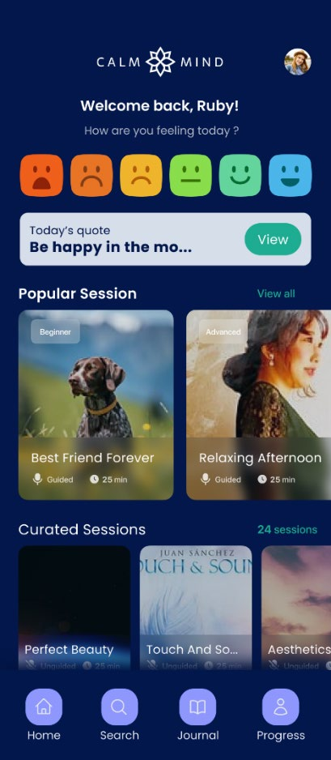
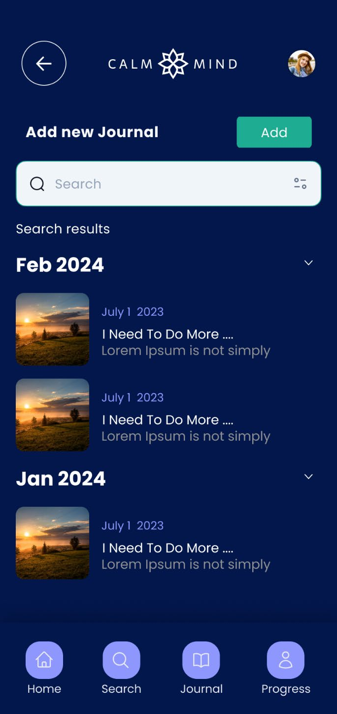
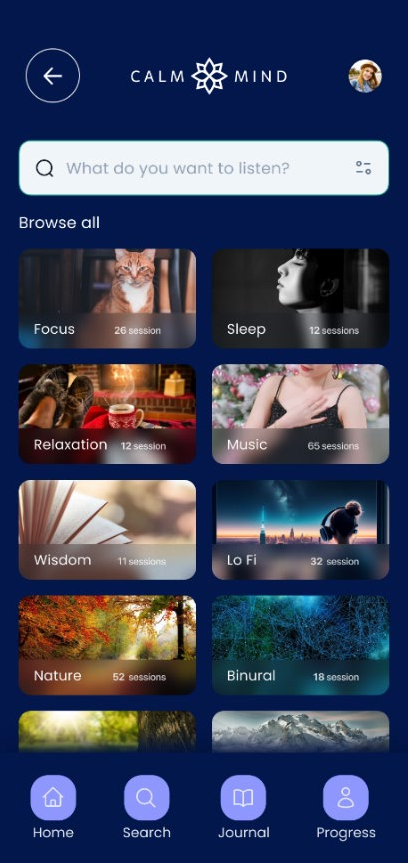
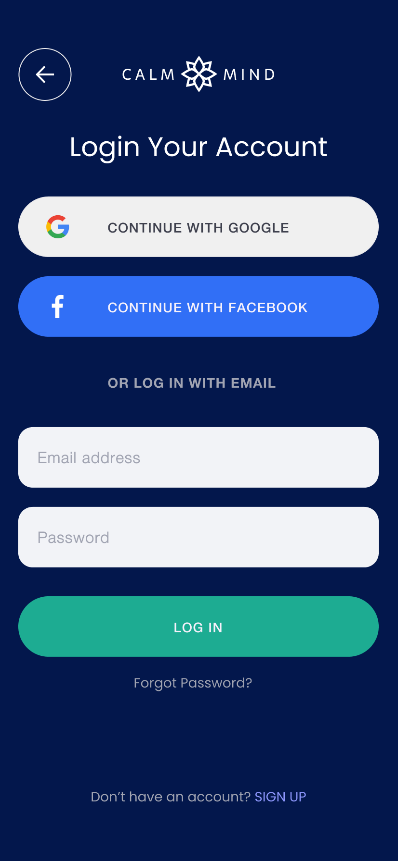
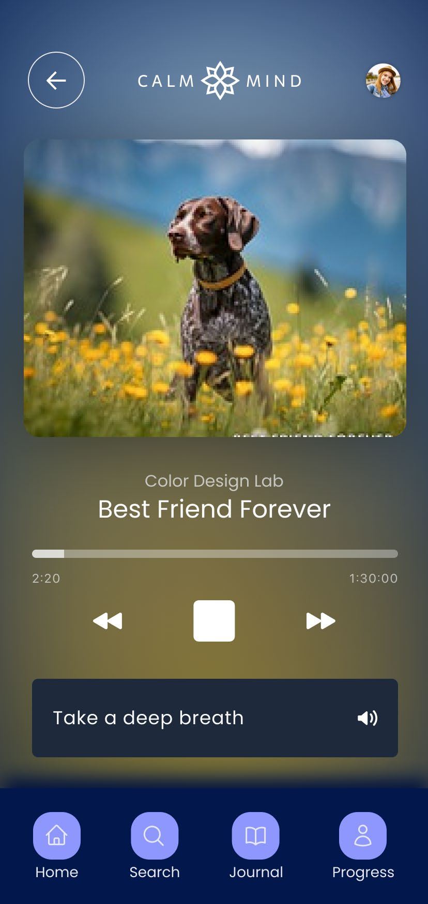
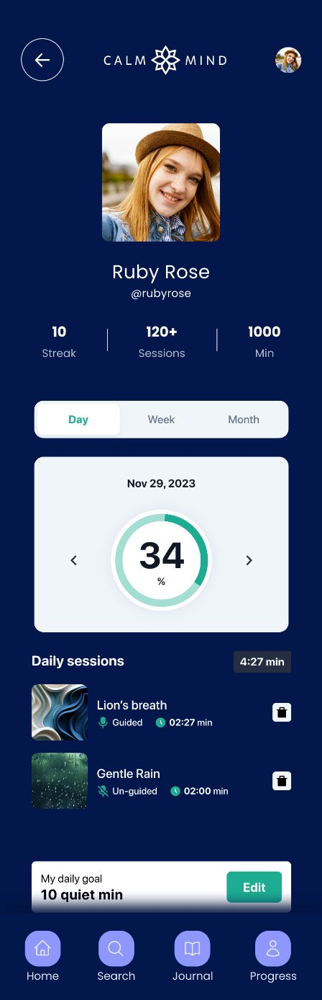
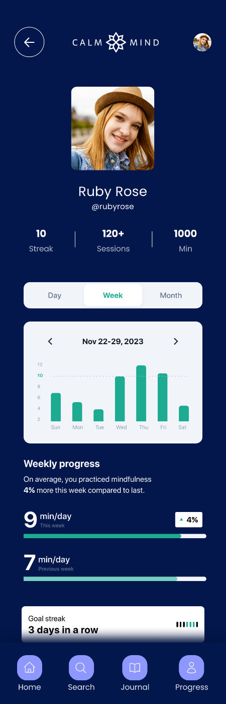
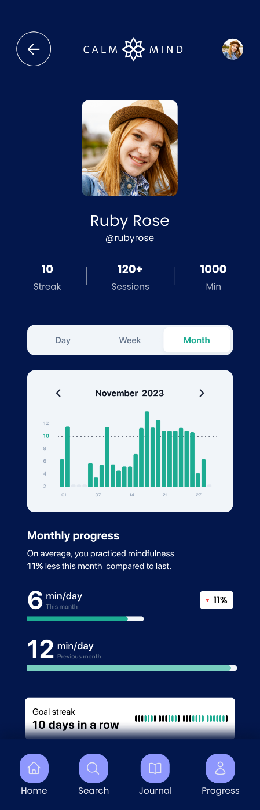

# Calm Mind

Calm Mind is a mobile application designed to promote mental wellness through mood tracking, guided meditation sessions, and personal journaling. Built with React Native and utilizing the Expo framework, Calm Mind offers a user-friendly experience across both iOS and Android platforms.

## Features

Mood Tracking: Log your mood daily with intuitive visuals and insights into your emotional trends over time.
Guided Meditation: Access a library of meditation sessions tailored to various needs and preferences, enhancing relaxation and mindfulness.
Journaling: Keep a personal journal to reflect on your thoughts, feelings, and experiences, with prompts to guide your writing.

         

## Getting Started

To run Calm Mind on your local machine for development and testing purposes, follow these steps.

## Prerequisites

Ensure you have Node.js and npm installed on your computer. Download Node.js and npm
https://nodejs.org/en/download

Expo CLI is also required:
npm install -g expo-cli

## Installation

Clone the repository:
git clone https://github.com/gshudhanshu/cm3050-mobile-development
Or download the zip file.

## Navigate to the project directory:

        cd cm3050-mobile-development

## Install the dependencies:

        npm install

## Start the Expo project:

        npx expo start

This will open a browser window with the Expo developer tools. You can then run the app on your device using the Expo Go app or on an emulator.

## Run the tests:

        npm test
